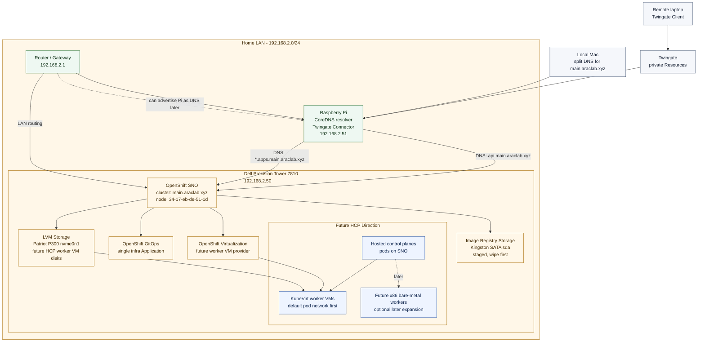

# Homelab Current Architecture

```mermaid
flowchart TB
  remoteClient["Remote laptop<br/>Twingate Client"]
  localClient["Local Mac<br/>split DNS for main.araclab.xyz"]
  twingate["Twingate<br/>private Resources"]

  subgraph home["Home LAN - 192.168.2.0/24"]
    router["Router / Gateway<br/>192.168.2.1"]
    pi["Raspberry Pi<br/>CoreDNS resolver<br/>Twingate Connector<br/>192.168.2.51"]

    subgraph tower["Dell Precision Tower 7810<br/>192.168.2.50"]
      sno["OpenShift SNO<br/>cluster: main.araclab.xyz<br/>node: 34-17-eb-de-51-1d"]
      gitops["OpenShift GitOps<br/>single infra Application"]
      virt["OpenShift Virtualization<br/>future worker VM provider"]
      lvm["LVM Storage<br/>Patriot P300 nvme0n1<br/>future HCP worker VM disks"]
      registry["Image Registry Storage<br/>Kingston SATA sda<br/>staged, wipe first"]

      subgraph futureHcp["Future HCP Direction"]
        hcp["Hosted control planes<br/>pods on SNO"]
        workerVms["KubeVirt worker VMs<br/>default pod network first"]
        bareMetalWorkers["Future x86 bare-metal workers<br/>optional later expansion"]
      end
    end
  end

  remoteClient --> twingate
  twingate --> pi
  localClient --> pi
  pi -->|"DNS: api.main.araclab.xyz"| sno
  pi -->|"DNS: *.apps.main.araclab.xyz"| sno
  router -->|"LAN routing"| pi
  router -->|"LAN routing"| sno
  router -. "can advertise Pi as DNS later" .-> pi

  sno --> gitops
  sno --> virt
  sno --> lvm
  sno --> registry

  hcp --> workerVms
  virt --> workerVms
  lvm --> workerVms
  hcp -. "later" .-> bareMetalWorkers

  classDef external fill:#f5f7fb,stroke:#5b6b84,stroke-width:1px,color:#162033;
  classDef network fill:#eef8f2,stroke:#3a7d44,stroke-width:1px,color:#12351a;
  classDef cluster fill:#fff7e8,stroke:#a66a00,stroke-width:1px,color:#3f2700;
  classDef future fill:#eef4ff,stroke:#315caa,stroke-width:1px,color:#10274f;

  class remoteClient,localClient,twingate external;
  class router,pi network;
  class sno,gitops,virt,lvm,registry cluster;
  class hcp,workerVms,bareMetalWorkers future;
```
